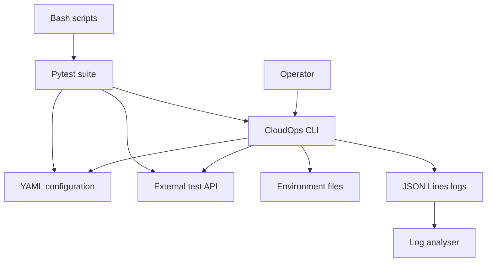
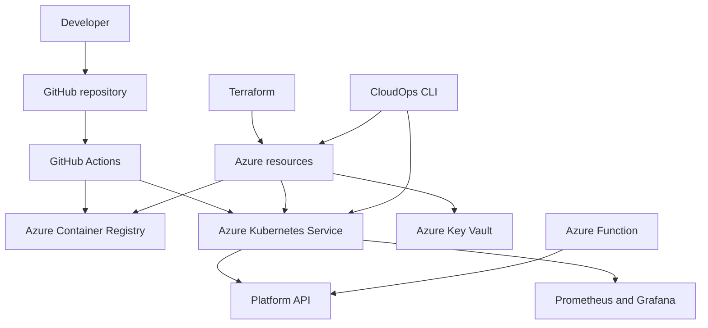

# Architecture Overview

## Project objective

The Azure CloudOps Platform is a production-style learning project that demonstrates how a DevOps engineer can provision, deploy, secure, observe and troubleshoot a containerised workload on Microsoft Azure.

The platform is being built incrementally. Components in the target architecture are not considered implemented until their corresponding phase is complete and verified.

## Current architecture: Phase 1

The current implementation runs locally and contains no Azure resources.

### Current components

| Component | Responsibility |
| --- | --- |
| CloudOps CLI | Provides a consistent operational interface |
| YAML configuration | Supplies environment-specific settings |
| Pydantic models | Validate types, required fields and constraints |
| HTTPX client | Performs REST API health checks |
| JSON logger | Records machine-readable operational events |
| Log analyser | Aggregates health-check results and detects malformed entries |
| Filesystem scaffolder | Safely generates environment configuration |
| Pytest suite | Verifies success, failure and safety behaviour |
| Bash scripts | Automate setup and local quality checks |

## Target architecture

### Planned Azure resources

- Resource group
- Terraform remote-state storage
- Virtual network and subnets
- Network security groups
- Azure Container Registry
- Azure Kubernetes Service
- Azure Key Vault
- Managed identities and role assignments
- Log Analytics workspace
- Public ingress, DNS and HTTPS configuration

### Planned deployment flow

1. A developer opens a pull request.
2. GitHub Actions runs formatting, linting, tests and security scans.
3. Terraform changes are validated and reviewed.
4. The application container is built and scanned.
5. The immutable image is pushed to Azure Container Registry.
6. Helm deploys the selected image version to AKS.
7. Kubernetes performs a rolling update.
8. The pipeline verifies rollout status and calls the health endpoint.
9. Prometheus collects metrics and Grafana displays platform health.

## Workload strategy

The primary owned workload will be a small Python FastAPI service with:

- `/health`
- `/ready`
- `/version`
- `/metrics`
- Structured application logs
- Automated tests

An external sample workload may be deployed for additional Kubernetes experimentation, but it will be clearly attributed. The portfolio's primary value is the independently implemented platform, automation and operational controls.

## Identity strategy

The target design avoids long-lived Azure credentials where practical:

- GitHub Actions authenticates to Azure through OpenID Connect.
- AKS workloads use Microsoft Entra workload identity.
- Applications access Key Vault through managed identity.
- Azure and Kubernetes permissions follow least privilege.

## Environment strategy

The tooling supports `dev`, `staging` and `prod` configuration patterns. To control portfolio costs, only the development environment is expected to run in Azure routinely. Other environments demonstrate reusable design and can be provisioned when required.

## Observability strategy

The platform will combine:

- Application metrics
- Kubernetes workload metrics
- Structured JSON logs
- Health and readiness probes
- Grafana dashboards
- Prometheus alert rules
- Azure-native logging where it adds operational value

## Security strategy

Security controls will be applied throughout the delivery lifecycle:

- Dependency scanning
- Secret scanning
- Static analysis
- Terraform and Kubernetes configuration scanning
- Container vulnerability scanning
- Non-root containers
- Key Vault secret management
- Workload identity
- Network policies
- HTTPS
- Restricted CI/CD permissions

## Cost strategy

Azure resources will use development-sized configurations. Expensive resources will be destroyed when they are not required, and the repository will contain explicit deployment and teardown instructions. Budget alerts will be configured before long-running infrastructure is introduced.
